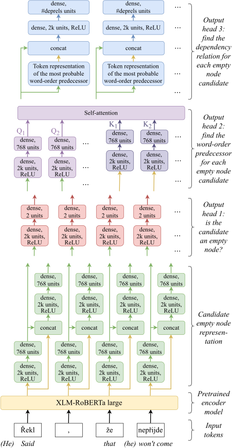
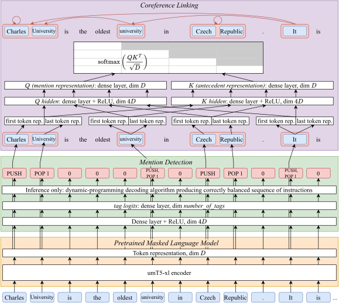

# CorPipe 25: CRAC 2025 Winning System for Multilingual Coreference Resolution

This repository will contain the source code and the pre-trained models of CorPipe 25,
the CRAC 2025 winning system for multilingual coreference resolution. Both will
be published before the CODI-CRAC 2025 workshop and are described in the
following paper:

---

<h3 align="center"><a href="https://arxiv.org/abs/2509.17858">CorPipe at CRAC 2025: Evaluating Multilingual Encoders for Multilingual Coreference Resolution</a></h3>

  <b>Milan Straka</b> 
  Charles University 
  Faculty of Mathematics and Physics 
  Institute of Formal and Applied Lingustics 
  Malostranské nám. 25, Prague, Czech Republic

**Abstract:** We present CorPipe 25, the winning entry to the CRAC 2025 Shared
Task on Multilingual Coreference Resolution. This fourth iteration of the shared
task introduces a new LLM track alongside the original unconstrained track,
features reduced development and test sets to lower computational requirements,
and includes additional datasets. CorPipe 25 represents a complete
reimplementation of our previous systems, migrating from TensorFlow to PyTorch.
Our system significantly outperforms all other submissions in both the LLM and
unconstrained tracks by a substantial margin of 8 percentage points.  
